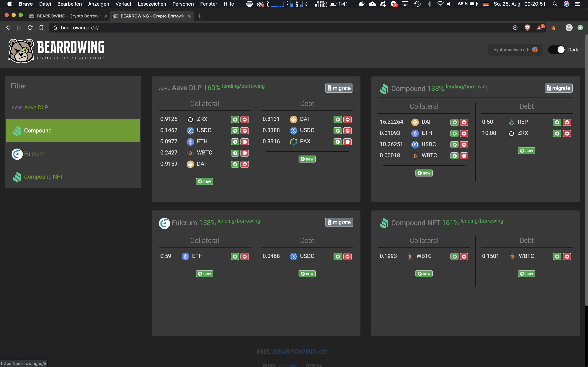

## Inspiration

We realized that Compound.Finance, MakerDAO, Nuo.network and other lending/borrowing platforms do not implemented tokenization of positions. This leads to missing interopability of the debts itself.

## What it does

And came up to idea tokenizartion layer can be implemented on top this platforms. And can achieve tradable debts and allowance to create smart contracts which can refinance or manage debts.

## How we built it

We created smart contract, which is owner of multiple sub smart contract, 1 per position and manage ERC721 tokens to determine which positions belongs to which addresdses.

## Challenges we ran into

It was complicated to debug transactions, we used remix assembly debugger and parity traces.

## Accomplishments that we're proud of

We did tokenization layer for Compound and partially for AAVE and MakerDAO, and sucessfully transferred debts between our wallets.

## What we learned

We learned a lot about lending platforms, how exactly they work and what differencies have

## What's next for Bearrowing

Will finish it and allow users to tokenize their current position

## Schema

## Screenshot

## Try it out
https://bearrowing.io
